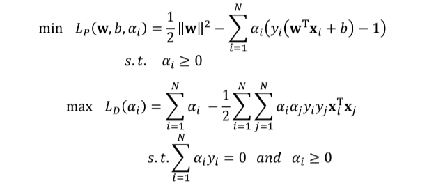
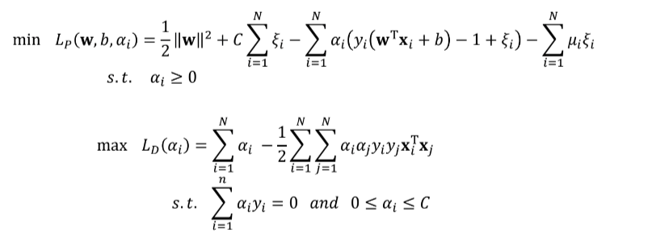

### 1. SVM에서 Soft and Hard Margin이란?

기본적으로 SVM은 선형으로 분리(Linearly Separable)된다고 가정한다.

하지만, 현실에서 선형으로 완벽히 분리가 되는 데이터는 찾아보기 어렵다. 따라서 SVM은 데이터의 오분류(error)를 허용해준다.

그렇지만 무분별하게 오분류를 허용하게 되면 classifier로써의 역할은 사라지게 때문에, SVM에서는 $C$ 라는 하이퍼파라미터를 통해 error를 얼마나 허용해 줄 것인지 정해준다. (하단의 수식 참고)

이때 error를 허용해주지 않는 경우를 Hard Margin SVM이라고 하는데 이는 사실 데이터를 선형으로 분리하는 SVM과 같다.

다음으로, error를 $C$값에 따라 어느정도 허용해주는 SVM은 Soft Margin SVM 이라고 한다.

해당 듀토리얼에서는 $C$ 값에 따른 SVM의 종류 (Hard Margin, Soft Margin)을 알아보고, C 값에 따른 Soft Margin SVM의 변화를 알아보고자 한다.

또한 Hard Margin SVM과 Soft Margin SVM의 실제 Support Vector가 어떻게 생성되는지 알아보고자 한다.

### 2. Hard Margin SVM(Lineary Separable SVM)

일반 SVM(Hard Margin SVM) 모델의 랑그랑지안 Primal 식과 Dual 식은 아래와 같다.

{width="50%," fig.align="center"}

### 3. Soft Margin SVM(SVM with Error)

Soft Margin SVM 모델의 랑그랑지안 Primal 식과 Dual 식은 아래와 같다.

{width="50%," fig.align="center"}

해당 식에는 위(Hard Margin)에는 식에는 없는 $C$ 가 존재하는데, 이는 뒤에 error($\epsilon_i$)를 얼마나 식에 반영할지 정하는 하이퍼 파라미터이다.

그런데, Hard Margin SVM과 Soft Margin SVM의 Dual식의 제약조건을 보면,

Soft Margin SVM에서 $a_i$가 $c$ 이하가 된다는 조건 이외에 두 식이 **모두 동일**함을 알 수 있다.

또한, 만약 Soft Margin SVM의 $c$가 $\infty$로 커지면 $c$ 이하가된다는 조건은 무의미해짐을 알 수 있다.

이런 경우 수식 상 Hard Margin과 Soft Margin SVM이 완벽히 같아짐을 알 수 있다.

그리고 만약 $c$가 매우 작아지면(0) error($\epsilon_i$)의 영향이 매우 작아지기 때문에 모든 error를 허용할 것이라고 예상할 수 있다.

(primal은 minimize 문제이기 때문에 $+C$가 0이되면 error의 영향이 무의미해짐 )

따라서 이후에는 다음과 같은 방법을 따라 실제로 Soft Margin SVM의 $c$가 $\infty$로 커지면 정말 Hard Margin SVM과 같아지는지 확인하고, $c$가 매우 작은 경우의 결과도 확인해 볼 예정이다.

1.  Linearly Saparable한 데이터를 생성한다.
2.  Soft Margin SVM의 $C$ 값이 아주 큰 경우($\infty$)를 설정하고 데이터를 분리한다.
3.  Soft Margin이지만 $C$가 아주 크게 되면 이론상 Hard Margin과 같아짐으로 데이터를 선형분리 할 수 있다.
4.  이때의 $w$ 값을 알아본다.
5.  추가적으로 $c$가 매우 작은 경우를 설정하고
6.  이때의 $w$ 값을 알아본다.

### Linearly Saparable한 데이터를 생성한다.

```{r setup, include=TRUE}
library(MASS)
library(e1071)
```

```{R}
n1 <- n2 <- 50 # 데이터 50개
m1 <- c(1.5,1) # 다변수정규분포1 평균 
m2 <- c(-2,-2) # 다변수정규분포2 평균

v1 <- v2 <- diag(2) # 0,1 설정
x1 <- mvrnorm(n1, m1, v1) # 다변수정규분포1
x2 <- mvrnorm(n2, m2, v2) # 다변수정규분포2

# linearly separable한 데이터 생성
plot(x1[,1],x1[,2],col=2,xlim=c(-4,4),ylim=c(-4,4)) # x1 data plot
points(x2[,1],x2[,2],col=3) # x2 data plot
```

### 생성된 데이터 확인

```{R}
# dataframe check
dat <- data.frame(cbind(rep(c(0,1),each=n1),rbind(x1,x2))) # x1=0, x2=1
colnames(dat) <- c("y","z1","z2")
dat
```

### Soft Margin SVM의 $C$ 값이 아주 큰 경우($\infty$)를 설정

```{R}
# Soft Margin with Large C
model_largec <- svm(as.factor(y)~.,kernel="linear",cost=10e15, data=dat) 
summary(model_largec)
predict(model_largec,dat[,-1])
```

### Soft Margin이지만 $C$가 아주 크게 되면 실제로 Hard Margin과 같아짐을 확인

### (=선형 분리됨)

```{R}
plot(model_largec,dat)
```

### 이때의 $w$ 값 확인(Support Vector가 존재함)

```{R}
model_largec$coefs 
```

### 추가적으로 $c$가 매우 작은 경우를 설정

```{R}
model_smallc <- svm(as.factor(y)~.,kernel="linear",cost=10e-15, data=dat) # c가 없는경우(cost=10e-15)으로 큰 경우
summary(model_smallc)
predict(model_smallc,dat[,-1])
```

### Soft Margin에서 $C$가 아주 작은 경우 확인

### (=선형 분리되는 것 처럼 보임)

```{R}
plot(model_smallc,dat)
```

### 이때의 $w$ 값 확인

### (모든 점이 support vector가 됨 = w가 전부 0 = 의미없음)

```{R}
model_smallc$coefs
```

### 결론

1.  Soft Margin SVM에서 $c$가 $\infty$가 되면 Hard Margin SVM(SVM)과 같다.
2.  Soft Margin SVM에서 $c$가 매우 작아지면 최적화 과정에서 error를 고려하지 않기 때문에 가능하지 않다 (의미없다)
